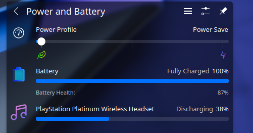
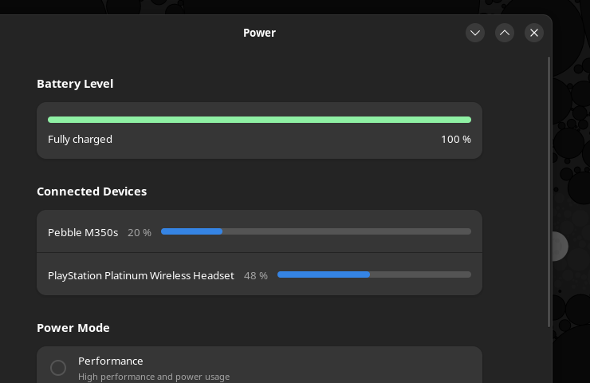

# hid-playstation-headset

Linux HID driver for PlayStation Gold and Platinum wireless headsets that reads its battery level




## Build and load

```shell
make
sudo insmod hid-playstation-headset.ko
```

## Technical details

Platinum headset receiver USB ID: `12ba:0050`  
Gold(V2) headset receiver USB ID: `12ba:0035`

This code might work with the older V1 Gold headset as well as the older PS3 headsets, but I don't have any to test with.

The headset itself is also a separate HID device (ID `12ba:0060` for Platinum) when connected over USB, but it does not send any packets.

The USB receiver sends out 8-byte HID packets every time one of the properties gets changed. A sample report looks like this:
```
b0 01 08 80 2d 14 11 00
-----------------------
0  1  2  3  4  5  6  7

0: constant 0xB0?
1: volume level (0x00 to 0x05).
    *the headset technically has 12 volume levels, but the receiver halves this to 6 levels for some reason.
2: sound-to-chat volume balance (0x00 to 0x64)
    *this value changes in 0x08 steps
3: battery level (0x00 to 0x64)
    *when charging, this value always becomes 0x80
4: bitfield of 8 flags:
    00000000
    |||||||^ is VSS enabled
    ||||||^ is microphone muted
    |||||^ ??
    ||||^ is the headset connected to the receiver
    |||^ ??
    ||^ is the headset in mode 2 (always 1 for Gold(V2) headset)
    |^ ?? (1 on Gold headset, 0 on Platinum)
    ^ ?? (constant 0?)
5: unknown, this value changes at random. most likely not a checksum
6: constant 0x11?
7: constant 0x00?
```